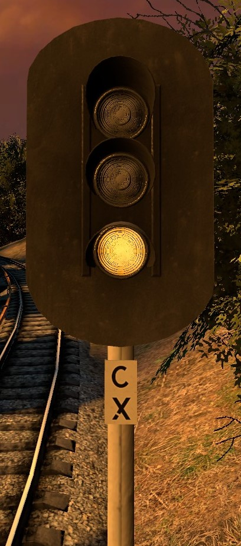

# LVP Signaling system Manual

*Version 1*

*Series: Lakeview subway*
*Book 1, Signaling system*

#### Table of contents

- 1 : First words
- 2 - 3 : Train safety systems
- 4 - 5 : Signaling system
- 6 : ALS/ARS : Cab signaling
- 7 - 9 : Signal meanings 

## First words

This manual is provided for Drivers who work on TR52 line what is nowadays a Subway testing line.
In this manual you will learn of new signals and safety system that aren't used on our Tram network.

This manual has been wrote by RPM signal workers as they did do Testing and final changes to signaling system itself.

> Lakeview transport director Nikita Mikhaylov - 1975

**Edited 1980**

*These manuals have gone thur lot of changes as in 1980 new signal system was introduced between City hall and Market street.*

## Signaling system
Signaling system is most important system in whole operation of TR52 line as trains goes faster than our trams what have been limited to 40km/h,  As all subway trains are rated to 80 ~ 90km/h,  Of course our line does not allow higher than 70km/h speeds.  This is just due of track layout, More of this in Book 2.

Signaling system on TR52 is build on template used by RPM subway but we have made some changes to it,  as first trains what we got did not have any ALS/ARS systems, so we had to add our own signal lights to them.   These old lighting pattens are still a used on 1/5 even when ALS/ARS system have been build.   These old pattens have been removed on 2/6 system portion as ALS/ARS takes that job from signals.

Signaling system on TR52 is a Semi and automated system, as between stations and junctions areas signals are automatic while in Stations and junction areas they are either controlled by dispatcher or Switch point itself.

## Train safety systems

First off, Big difference form driving a tram is that subway trains what we have in use do have more safety system onboard than on our trams.  Our system is based on RPM's signaling system but we have made your own changes to it.
ALS/ARS System is added as aftereffect so it's not used that much. 

All our trains have a "UAVA" This system stops the train if driver passes a red-yellow signal or Red signal, This system ofc is not installed on all signals due founding issues, so UAVA triggers can be found near the stations and the switches.

As we got trains with cab-signaling (ALS/ARS),  It brought lot of new systems what need to be laid next of tracks and placed into the cabs, These are:
- Speed monitoring, ALS: Prevents drivers from going over the indicate limit was is provided by ARS.
- ARS:  Track section speed limit.
- IGLA: Fire alarm
- ANSP / UPO announcers

All these systems were explained when you trained for TR52 line. so these will not be explained that well here.

## ALS/ARS (cab signaling, Ezh, Ezh3, Ema)
*Rewrote in 1980*

ALS/ARS system on TR52 is provided in two forms.  1/5 and 2/6, Difference in these is that 1/5 is a basic system,  this provides section speed limit on Rocklake - City hall section.
2/6 in other hand is a advanced form, As it's meant to be used as Cab signaling on lines what do not have visible signals. This would disallow usage of non-ALS/ARS trains on that section fully.
So in our system Changes were made to have active signals,  so in 2/6 signals provide section speed and upcoming speed drop area.  This has dropped out usage of ex:non-als/ars era signaling lights from City hall - Market street section.  These are still left on 1/5 section. 

## Signal meanings
*Edit: 1/5 system and added 2/6 signaling information*

These last pages tell what every signal states means,  This page was rewrote fully in 1980 when 2/6 section became active. 
This first part is for 1/5 signaling system.

##### Signal namings
Every sub part of signals have their own name / prefix what is used.
**2/6 system has UAVA trip arms on every signal**
Prefix | Meaning | Used where? 
------------ | ------------- | -------------
RL11 | Signal is part of Station area, **First Letters**:  station name, **First digit**: track number, **Second digit**: signal number, **Third digit**: used only if there is more than 9 signals in one route. | Inside station borders. |
325 | Automatic signal prefix, These signals do not have any switches near and can't be controlled via dispatching panels. | Anywhere as long they aren't in the station & junction borders.
SW121 | Junction signal prefix, These signals protect junctions and are equipped with **UAVA trip arms**. Prefix: **SW**: tells that signal is part of junction, **First digit**: Junction number, **Second digit**: Track number, **Third digit**: Signal number. | Inside junction borders.
32x / x42 | These are signals what have been placed when ALS/ARS system became a thing,  These signals do not check for track occupation and only provide ALS/ARS freq. | Between any place where ALS/ARS freq gets cut. + provide station with half point for speedlimit.
ENDRL1/2 | Track terminal signal, **END**: track ends, **RL**: Station name digit, (usually the nearest station). **1 or 2**: Track number, can be others too. | Used where track ends. (placed before buffer)

##### Signals light codes (States)
**Main Light patterns**
Light pattern | Meaning | ALS/ARS info | Speed limit | Notes | Exterior signal | Tunnel signal
------------------ | ----------------- | ------------ |--------------- | -------------- | ------------------- | ---------------
Red  |  Stop your train!! | 0 / 04 | 0 | - |   | 
Red - Yellow | Stop your train. | 04 | 0 - 20 | - |   | 
Blinking yellow | Next signal is red-yellow, slow your train to 20km/h | 40 | 20 - 40 | Pictures have steady yellow,  But they do blink! |  | 
Yellow | Warns about upcoming signal what is at danger | 40 | 40 | - |  | 
Yellow - Green | - | 40 - 60 | 40 - 60 | - |  | 
Green | - | 60 - 80 | 60 - 80 | - |  | 

**special light patterns**
Light pattern | Meaning | ALS/ARS info | Speed limit | Notes | Exterior signal | Tunnel signal
------------ | ------------- | ------------ |--------------- | -------------- | ------------------- | ---------------
Blinking / white | Clear to enter PTO / Depot in 15km/h | 04 | 15km/h | - |  | 
Blue | Used on 2/6 section start point. | - | 15km/h |  Only one signal is has this light. |  | 
**Market street - City hall section signaling. (2/6)**
**Main Light patterns**
Light pattern | Meaning | ALS/ARS info | Speed limit | Notes | Exterior signal | Tunnel signal
------------ | ------------- | ------------ |--------------- | -------------- | ------------------- | ---------------
Red  |  Stop your train!! | 0 / 04 | 0 | - |   | 
Red - Yellow | Stop your train. | 0 - 40 | 0 - 20km/h | - |   | 
Yellow | Warns about upcoming signal what is at danger | 40 - 60 | 40 - 60km/h | - |  | 
Yellow - Green | - | 60 - 70 | 60 - 70 | - |  | 
Green | - | 60 - 80 | 60 - 80 | - |  | 

**special light patterns**
Light pattern | Meaning | ALS/ARS info | Speed limit | Notes | Exterior signal | Tunnel signal
------------ | ------------- | ------------ |--------------- | -------------- | ------------------- | ---------------
Blinking / white | Clear to enter PTO / Depot in 15km/h | 04 | 15km/h | - |  | 